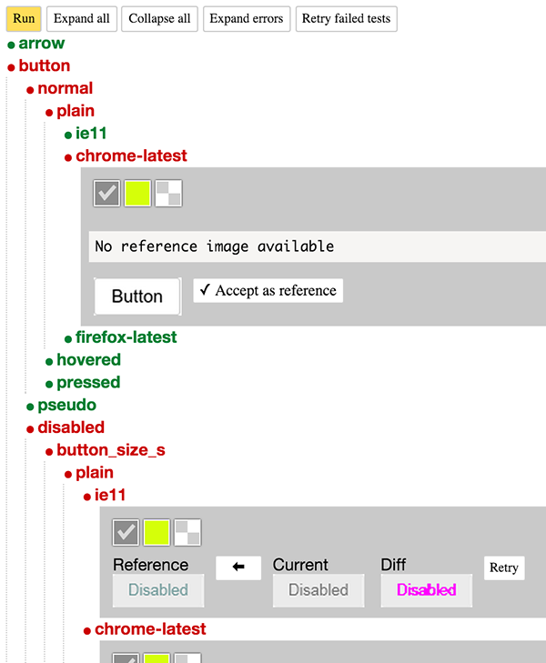

# Gemini GUI

[](https://travis-ci.org/bem/gemini-gui)

GUI for [gemini](https://github.com/bem/gemini) utility.



## Installation

Install globally with `npm`:

```
npm i -g gemini-gui
```

## Running

To be able to use `GUI` on a project you must have `gemini` installed
locally in this project. `GUI` will not work with `gemini` below 
`0.8.0`.

Run in the project root:

`gemini-gui ./path/to/your/tests`

Web browser with `GUI` loaded will be opened automatically.


## Options

* `--config`, `-c` - specify config file to use.
* `--port`, `-p` - specify port to run `GUI` backend on.
* `--hostname`, `-h` - specify hostname to run `GUI` backend on.
* `--root-url`, `-r` - use specified URL, instead of `rootUrl` setting from config file.
* `--grid-url`, `-g` - use specified URL, instead of `gridUrl` setting from config file.
* `--screenshots-dir`, `-s` - use specified directory, instead of `screenshotsDir` setting
from config.
* `--debug` - enable debug mode (verbose logging).

You can also override config file options with environment variables. Use `gemini`
[documentation](https://github.com/bem/gemini#configuration) for details.
